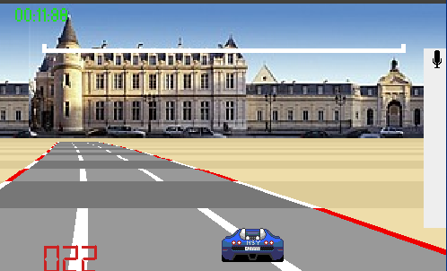

# processing-car
Drive a car, the car avance is you shout in a micro (if you don't have micro `up` and `down` works fine). 
Bonus if you have a Wiichuck controller and a Arduino. 

# How to install it.

This version also work with a num-chuck and an arduino. Please uncomment the line in the `pde` file.

# Credit
I use the article from [Lou's Pseudo-3d Page](http://www.extentofthejam.com/pseudo/)
I have ported the [RacerJs](https://github.com/onaluf/RacerJS) in processing. 
I also use the graphics. The original code is MIT Licence and Creative-Common for the art.

for connect the wii-chuck and arduino you only need four wires 
exemple here http://forum.kerbalspaceprogram.com/entries/728-KSP-Chuck-The-KSP-controller-with-style-%29

# License
The original javascript code is MIT.
I don't care much about my part. 
